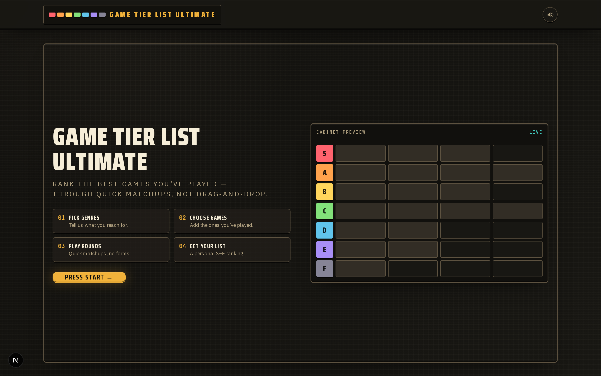

# Game Tier List Ultimate

Build a personalized **S–F tier list** of the best games you've played — through quick ranking
minigames instead of fiddly drag-and-drop. No account needed; your progress is saved to an anonymous
session and your final list is shareable via a short link.



## Tech stack

- **Next.js 15** (App Router) + **React 19** + **TypeScript**
- **Tailwind CSS** design system wired to CSS variables
- **Zustand** for client flow state
- **MongoDB** for the game catalog, sessions, and shared lists
- **IGDB** as a fallback search + enrichment source
- **Vitest** (unit/component/API) and **Playwright** (e2e)

## Getting started

```bash
npm install
cp .env.example .env   # then fill in real values
npm run dev            # http://localhost:3000
```

### Environment variables

| Variable             | Required | Description                               |
| -------------------- | -------- | ----------------------------------------- |
| `MONGODB_URI`        | yes      | MongoDB connection string                 |
| `IGDB_CLIENT_ID`     | yes      | IGDB (Twitch) client id for fallback search |
| `IGDB_CLIENT_SECRET` | yes      | IGDB (Twitch) client secret               |
| `MONGODB_DB`         | no       | Database name (default `guessthegame`)    |

Unit, API, and e2e tests use in-memory Mongo + mocked IGDB, so they don't need real credentials.

## Scripts

| Command               | What it does                                          |
| --------------------- | ----------------------------------------------------- |
| `npm run dev`         | Start the dev server                                  |
| `npm run build`       | Production build (also serves as the typecheck)       |
| `npm run start`       | Run the production build                              |
| `npm run lint`        | ESLint (`next lint`)                                  |
| `npm run test`        | Vitest run (unit + component + API)                   |
| `npm run test:e2e`    | Playwright e2e (`npx playwright install` on first run)|
